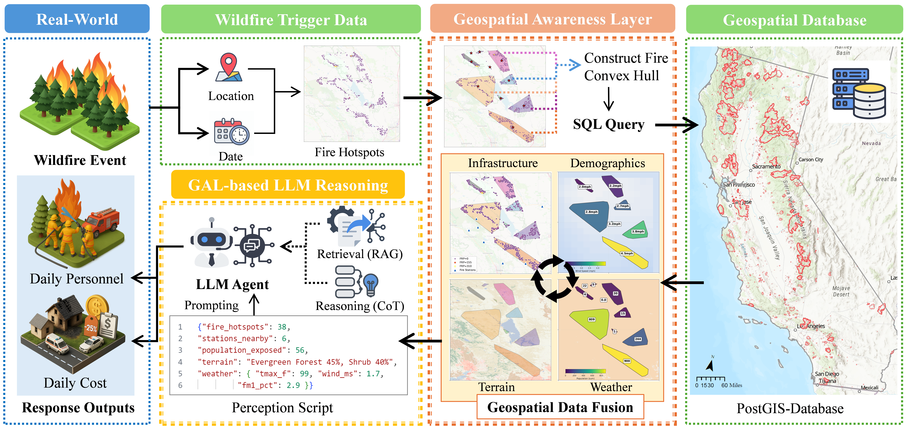
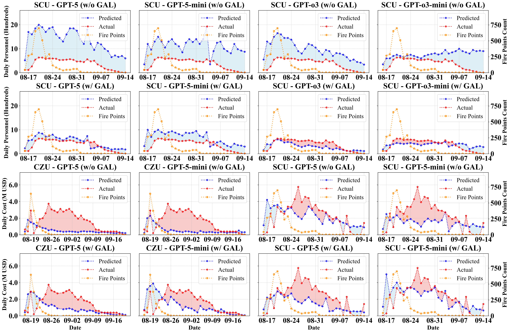
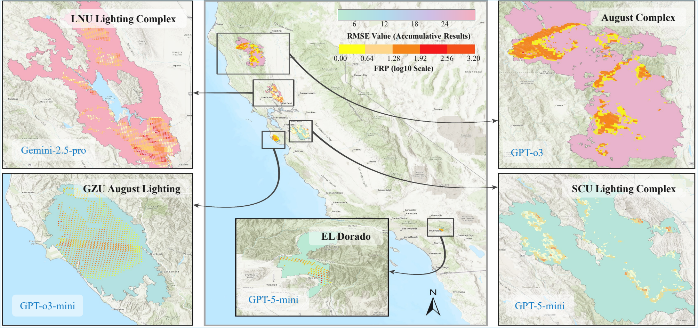

# GAL: Geospatially Grounded LLM Agents for Wildfire Resource Forecasting

<div align="center">

[](https://arxiv.org/pdf/2510.12061) [](https://arxiv.org/abs/2510.12061) [](LICENSE)

</div>

> GAL equips LLM agents with a Geospatial Awareness Layer (GAL) that grounds wildfire decisions in structured Earth data.
>
> Starting from daily hotspot detections and timestamps, the system retrieves infrastructure, demographic, terrain, and weather evidence from a spatial database, compresses them into a unit-locked perception script, and asks an LLM to estimate today's `daily_personnel` and `daily_budget`.
>
> Historical analog retrieval (RAG) and rolling temporal summaries help the agent stay cautious, stable, and evidence-based across multi-day incidents.

## From Raw Fire Detections to Grounded Resource Decisions

Wildfire resource estimation is difficult for both pure statistical baselines and text-only prompting.

**Text-only reasoning**
- Cannot directly access population exposure, terrain fragmentation, station coverage, or weather rasters.

**Single-signal heuristics**
- Over-rely on one indicator such as FRP or hotspot counts, missing the operational context needed for staffing and daily spend decisions.

**Static feature pipelines**
- Often pass raw features to the model without a stable intermediate representation, making outputs noisy and hard to audit over time.

GAL addresses these issues by converting multi-source geospatial evidence into a compact, fixed-field perception layer that LLMs can reason over consistently.

## GAL Framework



### Core Components

- **State grounding**. Clusters raw wildfire detections into daily activity footprints with FRP-aware centroids and fallback handling for sparse detections.
- **Geospatial retrieval**. Pulls exposure, accessibility, terrain, and weather attributes from PostGIS-backed vector and raster sources.
- **Perception script**. Converts heterogeneous raw data into a compact, unit-annotated representation with conservative defaults for missing values.
- **LLM reasoning layer**. Uses prompt templates plus schema-constrained parsing to produce structured recommendations for daily staffing and daily budget.
- **Historical analogs (RAG)**. Retrieves similar incident-days to provide soft lower and upper bounds for current recommendations.
- **Incremental stability**. Injects previous-day summaries, rolling windows, and cumulative signals to reduce day-to-day oscillation.

## Why The Geospatial Awareness Layer Matters

- **Geospatial grounding for LLMs**: bridges text-only reasoning and real-world wildfire context through a structured interface to Earth data.
- **Stable intermediate representation**: the perception script gives the model a fixed decision surface instead of raw, noisy upstream data.
- **Operationally relevant evidence**: terrain, weather, population exposure, and station accessibility are considered jointly rather than in isolation.
- **Retrieval-augmented calibration**: similar historical fire-days provide soft bounds that improve consistency and reduce unrealistic jumps.

## Experimental Highlights

- Across held-out California wildfire incidents, GAL-grounded agents outperform a physical baseline and an LSTM on daily personnel and daily cost forecasting.
- Ablations indicate that both GAL and RAG improve stability and reduce large errors, especially for multi-cluster incidents.
- Compact reasoning models can match or exceed larger backbones once they are grounded by the perception script and historical analog context.
- The framework is designed to extend beyond wildfire response to other hazards such as floods and hurricanes.



## Spatial Qualitative Examples

The GAL also supports spatially grounded qualitative analysis by aligning model outputs with wildfire hotspot distributions and regional context.



## Repository Structure

```text
GAL4EACL-main/
|-- README.md
|-- requirements.txt
|-- .env.example
`-- final-cut/
    |-- analysis.py
    |-- fire_agent.py
    |-- overall_pipeline.py
    |-- rag_corpus_builder.py
    |-- build_trend_rag_index.py
    |-- terrain_analysis.py
    |-- db_fetcher.py
    |-- database.py
    |-- prompt_*.py
    |-- rag_*.py
    `-- utils/
```

### Key Entry Points

- `final-cut/analysis.py`: single-day geospatial analysis and summary assembly
- `final-cut/fire_agent.py`: end-to-end agent workflow (analysis -> prompt -> LLM -> parsing)
- `final-cut/overall_pipeline.py`: batch processing for multiple fires and dates
- `final-cut/rag_corpus_builder.py`: builds standard and trend-oriented RAG indices
- `final-cut/terrain_analysis.py`: NLCD-based terrain metrics and spread-oriented summaries
- `final-cut/config.py`: database settings, unit systems, model settings, prompt toggles, and run configuration

## Quick Start

### 1. Create an environment

```bash
python -m venv .venv
```

Windows PowerShell:

```powershell
.venv\Scripts\Activate.ps1
```

macOS / Linux:

```bash
source .venv/bin/activate
```

### 2. Install dependencies

```bash
pip install -r requirements.txt
```

### 3. Configure credentials

```powershell
Copy-Item .env.example .env
```

Then update `.env` with:

- PostGIS connection details
- `OPENAI_API_KEY` for OpenAI models, or
- `GOOGLE_API_KEY` for Gemini models

Only one LLM provider is required for a run.

### 4. Review runtime settings

Before running the pipeline, update [`final-cut/config.py`](final-cut/config.py) as needed:

- `RUN_FIRES`
- `OUTPUT_ROOT`
- `LLM_CONFIG`
- `PROMPT_PLUGINS`
- `RAG_CONFIG`
- table names and database connection defaults

## Running The Code

### Batch wildfire pipeline

```bash
python final-cut/overall_pipeline.py
```

This is the main end-to-end entry point. It reads the configured fires, walks through each date in chronological order, queries geospatial context, runs the agent, and writes outputs under `runs/<timestamp>/`.

### Build the standard RAG corpus

```bash
python final-cut/rag_corpus_builder.py
```

Useful flags:

```bash
python final-cut/rag_corpus_builder.py --list-fires
python final-cut/rag_corpus_builder.py --fires LNU_LIGHTNING_COMPLEX SCU_LIGHTNING_COMPLEX
python final-cut/rag_corpus_builder.py --build-trend
```

### Build the trend RAG index from saved JSON analyses

```bash
python final-cut/build_trend_rag_index.py
```

`analysis.py` currently contains a hard-coded example fire/date pair for quick inspection and JSON export.

## Data Prerequisites

This repository contains the code, but not the full underlying geospatial assets or generated experiment outputs.

The pipeline expects:

- wildfire detections loaded into a `fire_daily_points` table
- county boundaries in `ca_boundary_geom`
- fire station locations in `fire_stations`
- population rasters in `capop_2020_100m`
- NLCD land-cover rasters in `ca_clipped`
- weather rasters in the configured `WEATHER_TABLES`
- cleaned daily ground-truth CSV files under `final_data_cleaned/`

## Outputs

A typical pipeline run writes:

- `runs/<timestamp>/run_config.json`: configuration snapshot
- `runs/<timestamp>/overall.csv`: aggregated predictions and comparisons
- `runs/<timestamp>/<FIRE_NAME>/`: per-fire folders
- per-day prompt / response logs for auditability
- `rag_data/rag_index.npz` and `rag_data/rag_meta.json`: standard RAG index
- `rag_data/rag_trend_index.npz` and `rag_data/rag_trend_meta.json`: trend RAG index

## Citation

If you use this codebase, please cite:

```bibtex
@article{chen2025empowering,
  title         = {Empowering LLM Agents with Geospatial Awareness: Toward Grounded Reasoning for Wildfire Response},
  author        = {Chen, Yiheng and Li, Lingyao and Ma, Zihui and Hu, Qikai and Zhu, Yilun and Deng, Min and Yu, Runlong},
  journal       = {arXiv preprint arXiv:2510.12061},
  year          = {2025},
  doi           = {10.48550/arXiv.2510.12061}
}
```
